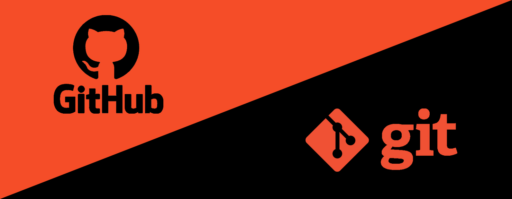

# GIT BÁSICO

Guia prático para iniciantes.

Aula ministrada pelo maykbrito: https://www.youtube.com/watch?v=2alg7MQ6_sI&t=136s

### Instalação

https://git-scm.com/download

# SCENES

- [x] Você deseja criar pontos na história da produção do seu projeto.
- [x] Você deseja verificar mudanças feitas no seu projeto.

- [x] Você começa uma nova funcionalidade no seu projeto, sem estragar o que ja foi feito.
- [x] Você adciona as novas funcionalidade ao seu projeto em produção.
- [x] Você quer deletar a branch da nova funcionalidade, depois de aplicar em seu projeto.

- [x] Você quer colocar seu projeto na nuvem.

- [x] Você vai pegar um projeto já iniciado, para trabalhar com o time.
- [x] Você precisa resolver um conflito.
- [x] Antes de enviar a resolução, precisamos atualizar o projeto local.

- [x] Você precisa voltar um arquivo para um determinado momento da linha do tempo.
- [x] Você precisa recuperar algo deletado.

* `git init`                                         // inicia a linha do tempo.
* `git add`                                          // adciona ou atualiza mudanças para irem a linha do tempo.
* `git .`                                            // adciona todas as mudanças de todos os arquivos para irem a linha do tempo.
* `git commit -m`                                    // adciona um ponto na linha do tempo.
* `git commit -am`                                   // adciona um ponto com as atualizações na linha do tempo.
* `git log`                                          // visualiza os pontos na linha do tempo /commit.
* `git status`                                       // informa o estado das alterações do nosso projeto.
* `git show`                                         // apresenta determinado ponto na história.
* `git branch`                                       // gerenciar novas linhas do tempo.
* `git checkout`                                     // manipula novas linhas do tempo.
* `git checkout -b`                                  // manipula novas linhas do tempo adcionando uma nova branch(-b) + o nome do seu projeto.
* `git checkout "insira o log" -- "insira o arquivo"` // recupera as alterações feitas na linha do tempo.
* `git merge`                                        // Unir linhas do tempo.
* `git push`                                         // envia alterações locais para o repositório remoto.
* `git clone`                                        // Clonar um projeto / repositório.
* `git pull`                                         // Atualiza os arquivos locais com as alterações do repositório remoto atual. 